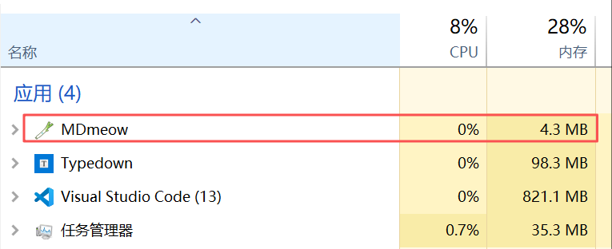

[简体中文](README.md) · [English](README.en.md) · [日本語](README.ja.md) · **Deutsch**

# MDmeow

> **Markdown öffnen. Sofort loslegen.**
>
> **Ein leichter WYSIWYG-Markdown-Editor für das KI-Zeitalter.**

Je häufiger wir mit KI-Agenten arbeiten, desto mehr wird **Markdown zu einem der wichtigsten Dokumentformate zwischen Mensch und KI**.

Anforderungen, Entwicklungsnotizen, KI-Ausgaben, Forschungsnotizen, README-Dateien – immer mehr tägliche Arbeit landet am Ende in einer `.md`-Datei.

Dafür braucht es nicht immer eine große Schreib- oder Wissensplattform. Oft reicht ein Markdown-Editor, der **schnell startet, direkt in der formatierten Ansicht bearbeitet und nicht im Weg steht**.

Dafür gibt es **MDmeow**.

Das Ziel ist einfach:

**Markdown so schnell öffnen wie eine Textdatei und so selbstverständlich bearbeiten wie ein normales Dokument.**

Leicht, schnell und unaufdringlich. Ob KI-generiertes Dokument, README oder kurze Notiz: Datei öffnen und direkt weiterarbeiten.

## Leichtgewichtig ist Teil des Konzepts



> Die Abbildung zeigt ein leeres Dokument auf einem Windows-System. Der tatsächliche Ressourcenverbrauch hängt unter anderem vom Dokumentinhalt, WebView2 und der Systemumgebung ab.

MDmeow basiert auf **Tauri + Milkdown/Crepe**. Es soll keine schwere Wissensmanagement-Suite sein, sondern ein praktischer Desktop-Editor für den täglichen Umgang mit Markdown.

## Warum MDmeow

### WYSIWYG, ohne Markdown aufzugeben

Du arbeitest in einer formatierten Dokumentansicht, während die Datei auf der Festplatte normales, portables Markdown bleibt.

- Überschriften, Listen, Zitate, Aufgabenlisten, Tabellen, Links, Fußnoten und weitere gängige Markdown-Elemente direkt bearbeiten
- Jederzeit in eine eigene **Quellansicht** wechseln
- Keine Bindung an ein proprietäres Dokumentformat
- Standard-Markdown-Bilder und gängige rohe HTML-``-Blöcke
- Inhalte wie `<!--more-->` im Quelltext behalten, ohne die WYSIWYG-Ansicht zu stören

MDmeow soll sich in deinen Workflow einfügen, nicht ihn übernehmen.

### Bilder sollen genauso einfach zu bearbeiten sein

Ein Klick auf ein Bild öffnet eine kompakte Bild-Werkzeugleiste:

- Bildtitel bearbeiten
- Links / zentriert / rechts ausrichten
- Von 25% bis 200% skalieren
- Bild löschen
- Einheitliche Bedienung für Markdown- und HTML-Bilder

Wenn Skalierung oder Ausrichtung gespeichert werden müssen, verwendet MDmeow HTML, das weitgehend mit Typedown kompatibel ist:

```html

```

Relative Bildpfade werden weiterhin ausgehend von der aktuellen Markdown-Datei aufgelöst.

### Code und Formeln im selben Editor

MDmeow bringt den Dokumentstil **Miku Cream** mit:

- Helle Codeblöcke
- Syntaxhervorhebung
- Eigene Zeilennummern für Code
- Kopier-Schaltfläche mit Erfolgsfeedback
- Klar erkennbare Inline-Code-Darstellung
- KaTeX für Inline- und Blockformeln
- Formeln bleiben standardmäßig in der Vorschau und öffnen den Quelltext erst beim Bearbeiten

Beispiel:

```text
$E = mc^2$

$$
\int_a^b f(x)\,dx
$$
```

### Dateien öffnen, ohne nachzudenken

- `.md`, `.markdown`, `.mdx` und `.txt` per Drag & Drop öffnen
- MDmeow unter Windows als „Öffnen mit“-Ziel für Markdown registrieren
- Eine vorhandene Installation verwaltet Dateizuordnungen bevorzugt
- Ohne gültige Installation kann die portable Version als Fallback übernehmen
- Dateinamen direkt über die Titelleiste umbenennen
- Mehrere Tabs
- Letzte Sitzung wiederherstellen

### HTML / PDF direkt ausgeben

Die Export-Schaltfläche bietet zwei klare Ziele:

- **HTML exportieren**: eigenständig öffnungsfähige Seite erzeugen
- **PDF exportieren**: PDF über den Systemdruckdialog ausgeben

Kein zusätzlicher Editor nur für die Übergabe eines Dokuments.

### Proxy für entfernte Inhalte

Wenn Markdown auf GitHub Raw, einen Bilderhost oder andere entfernte Ressourcen verweist, kann MDmeow einen Proxy verwenden:

- HTTP / HTTPS
- SOCKS5 / SOCKS5H
- Eingebauter Verbindungstest
- Adresse bleibt auch bei deaktiviertem Proxy erhalten und editierbar
- Dieselbe Proxy-Konfiguration wird für entfernte Bilder und Updates verwendet

Beispiele:

```text
http://127.0.0.1:7897
socks5://127.0.0.1:7893
```

### Updates direkt über GitHub

MDmeow kann GitHub Releases auf neue Versionen prüfen und heruntergeladene Update-Artefakte per Signatur verifizieren.

Unter Windows:

- **Installierte Version**: neue MSI herunterladen und Update starten
- **Portable Version**: neue EXE neben der aktuell laufenden Version speichern
- Die laufende portable EXE wird nicht heimlich überschrieben
- Manuelle Update-Prüfung jederzeit möglich
- Automatische Prüfung standardmäßig höchstens einmal alle 24 Stunden
- Fehlgeschlagene automatische Prüfungen stören die Bearbeitung nicht

GitHub Releases dienen direkt als Update-Quelle; ein zusätzlicher Update-Server ist nicht nötig.

## Weitere Funktionen für den Alltag

- **Vier UI-Sprachen**: 简体中文, English, 日本語, Deutsch
- **Frei belegbare Tastenkürzel**
- **Separate Schriftarten und Größen für Editor und Quellansicht**
- **Konfigurierbare Akzentfarbe**, standardmäßig `#39C5BB`
- **Rechtschreibprüfung**
- Optionen wie vollständige Pfade oder dauerhaft sichtbare Tableiste
- **Portable EXE und MSI-Installer** mit passendem Verhalten für beide Modi

## Download

Neueste Version:

**https://github.com/zakee039/MDmeow/releases/latest**

### Windows

Je nach Arbeitsweise:

```text
MDmeow-<version>.exe
```

Portable Einzeldatei. Einfach in einen Werkzeugordner, auf einen USB-Stick oder an einen anderen Ort legen und ohne Installation starten.

```text
MDmeow_<version>_x64.msi
```

Standard-MSI für die dauerhafte Installation und Windows-Dateizuordnungen.

Das Repository enthält weiterhin Build-Abläufe für Linux und macOS. Falls auf der Release-Seite kein passendes Paket vorhanden ist, kann MDmeow aus dem Quellcode gebaut werden.

## Tastenkürzel

| Aktion | Standard |
| --- | --- |
| Neuer Tab | `Ctrl/Cmd+N` |
| Öffnen | `Ctrl/Cmd+O` |
| Speichern | `Ctrl/Cmd+S` |
| Speichern unter | `Ctrl/Cmd+Shift+S` |
| Tab schließen | `Ctrl/Cmd+W` |
| HTML / PDF exportieren | `Ctrl/Cmd+E` |
| Quellansicht umschalten | `Ctrl/Cmd+/` |
| Suchen | `Ctrl/Cmd+F` |
| Ersetzen | `Ctrl/Cmd+H` |
| Emoji | `Ctrl/Cmd+.` |
| Einstellungen | `Ctrl/Cmd+,` |
| Blocktyp wechseln | `Ctrl/Cmd+0` – `7` |

Alle App-Kurzbefehle lassen sich unter **Einstellungen → Tastenkürzel** neu belegen.

## Konfiguration

MDmeow speichert Einstellungen in `settings.toml` und unterstützt Hot Reload.

Häufige Optionen:

```toml
language = "system"
spellcheck = true
quit_on_escape = false
open_last_session = true
always_show_tabbar = false
show_path = false

editor_font = ""
editor_font_size = 16
source_font = ""
source_font_size = 15

accent = "#39C5BB"

proxy_enabled = false
proxy_url = ""
auto_check_updates = true
```

`Mod` bedeutet Ctrl unter Windows/Linux und Cmd unter macOS.

## Aus dem Quellcode bauen

Voraussetzungen:

- Node.js 20+
- `pnpm`
- Rust stable
- Windows: Visual C++ Build Tools, Windows SDK, WebView2

Entwicklung:

```bash
pnpm install
pnpm build
pnpm tauri dev
```

Release-Builds:

```powershell
# Windows
pnpm release:windows
```

```bash
# Linux
pnpm release:linux

# macOS
pnpm release:macos
```

Nützliche Prüfungen:

```bash
pnpm exec tsc --noEmit
cargo check --manifest-path src-tauri/Cargo.toml
cargo test --manifest-path src-tauri/Cargo.toml
```

## Technik

| Ebene | Technologie |
| --- | --- |
| Desktop | Tauri v2 / Rust |
| WYSIWYG | Milkdown Crepe / ProseMirror |
| Quelltext | CodeMirror |
| Mathematik | KaTeX |
| Markdown → HTML | comrak |
| Syntaxhervorhebung beim Export | highlight.js |
| Windows-Installer | WiX / MSI |

## Credits

MDmeow basiert auf **Ali Naderi / Mowl** und bleibt unter der **MIT License** verfügbar.

Danke an das Upstream-Projekt für einen klaren und eleganten Ausgangspunkt.

Darauf aufbauend wurde MDmeow für praktische Desktop-Workflows weiterentwickelt: WYSIWYG- und Quellansicht, Miku Cream, Bildbearbeitung, Code und Formeln, HTML/PDF-Export, Lokalisierung, frei belegbare Kurzbefehle, Windows-Dateizuordnungen, portable/installierte Modi, Proxy-Unterstützung und signierte GitHub-Updates.

> **Markdown öffnen. Sofort loslegen.**
